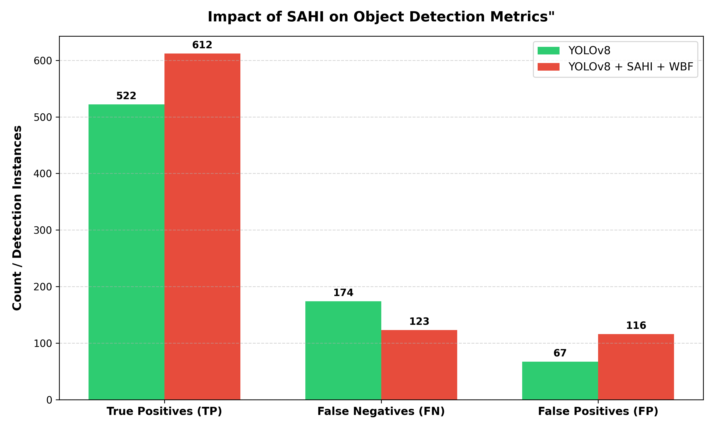

# 🌾Rice-Leaf-Disease-Detection-System

## 📌 Pipeline Architecture:

🚀 Data Engineering ➔ 🧑‍💻 Model Training ➔ 📊 Advanced Inference & Evaluation Framework

---
## 🚀 Data Engineering & Preprocessing
- Raw Data Collection
- Data Preprocessing
- Manual Annotation
- Dataset Balancing
- Dataset Splitting
---
## 🧑‍💻 Model Training
- Core Architecture: Training and fine-tuning state-of-the-art anchor-free object detection models utilizing the YOLOv8 framework.
- Evaluation Metric.

---
## 📊 Advanced Inference & Evaluation Framework (Test Set)
- Standard YOLO Inference: Running the baseline trained model to capture standard global features.
- Slicing Aided Hyper Inference (SAHI): Partitioning test images into overlapping patches to drastically boost sensitivity for ultra-small objects and micro-lesions.
- Filtering: Implementing custom thresholds to eliminate false positives.
- Weighted Boxes Fusion (WBF): Fusing and resolving overlapping bounding boxes generated by both standard and sliced inferences into unified, definitive predictions.
- Custom Metric Evaluation Engine: Instead of using standard, rigid 1-to-1 matching evaluation metrics, a custom-built evaluation function was implemented. This custom engine allows multiple valid overlapping prediction boxes to match with a single ground truth target. This approach provides a much more accurate and realistic calculation of TP, FP, and FN when dealing with dense, clustered features or fragmented predictions.

---
## 🏆 Experimental Results

| Metric | YOLOv8 | YOLOv8 + SAHI + WBF |
| :--- | :---: | :---: |
| **F1-Score** | 0.813 | 0.837 |
| **True Positives (TP)** | 522 | 612 |
| **False Negatives (FN)** | 174 | 123 |
| **False Positives (FP)** | 67 | 116 |
| **Precision** | 0.89 | 0.84 |
| **Recall** | 0.75 | 0.83 |

---
### 🔍 Analytical Summary 
- To evaluate the dynamic shift in detection capabilities, the performance of the standard YOLOv8 architecture was benchmarked against the SAHI-enhanced pipeline using a synchronized test set.

#### 📈 Core Performance Shift
The empirical results demonstrate that the SAHI-enhanced pipeline achieved a **17.2% increase in True Positive (TP) detections** while significantly reducing the False Negative (FN) rate. This structural inversion proves the pipeline's aggressive efficiency in reclaiming missed targets and minimizing silent errors.

#### ⚖️ Trade-off
The integration of SAHI also introduced an observed increase in False Positives (FP), rising from 67 to 116. In data science, this represents a classic and critical **Sensitivity vs. Specificity Trade-off**:
* **High Sensitivity (Recall):** The pipeline prioritizes capturing every potential target, making it exceptionally good at discovering hidden features.
* **Lower Specificity (Precision):** The trade-off for this extreme sensitivity is a higher rate of conservative predictions being flagged as false alarms against the rigid ground truth.

#### 👁️ The "Super-Detection" Phenomenon
From a technical perspective, this behavior reflects the **"super-detection" capabilities** inherent to the SAHI framework rather than architectural failures:
* **Granular Spatial Resolution:** By performing inference on sliced patches at their original spatial resolution, the pipeline successfully identifies features and lesions at ultra-small, micro-stages.
* **Human Annotation Bottlenecks:** These early-stage granular features are frequently overlooked by both standard global models and human annotators during manual labeling due to visual scaling constraints.
* **Re-evaluating "False Errors":** Consequently, many of these 116 additional detections are not necessarily true errors. Instead, they are a direct manifestation of the system's advanced capability to detect actual micro-features at an early stage that bypassed the original, less sensitive ground truth masks.
